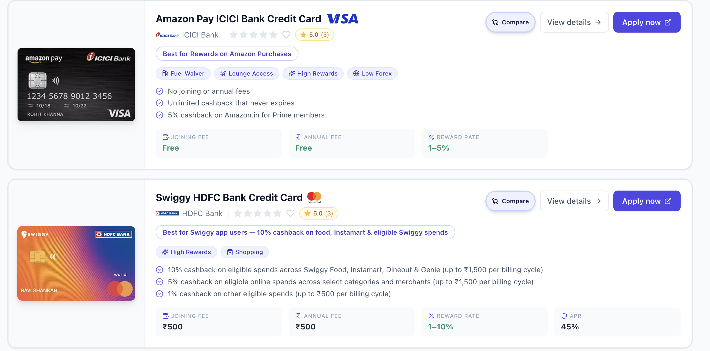

# react-credit-card-canvas

> A modern, responsive React & Tailwind CSS component for rendering credit cards, bank badges, perk tags, and fee breakdowns.



Designed for FinTech apps, payment checkouts, and wallet tools. Powered by **[CardCheck.in](https://cardcheck.in/?utm_source=github&utm_medium=referral&utm_campaign=open_source_repo)**.

---

## Features

- **Realistic Credit Card Art Display:** Renders card visuals with realistic drop-shadows and hover zoom animations.
- **Smart Perk Badges:** Automatic visual tags for Fuel Waivers, Lounge Access, High Rewards, and Forex Markups.
- **Indian Rupee (INR) Formatting:** Native support for Indian financial data, joining fees, annual fees, and APR rates.
- **Tailwind CSS & Framer Motion Ready:** Smooth entrance animations and fully customizable responsive layouts.

---

## Installation

```bash
npm install react-credit-card-canvas framer-motion lucide-react
```

---

## Usage Example

```tsx
import { CreditCardCard } from 'react-credit-card-canvas';

const cardData = {
  id: 'hdfc-regalia-gold',
  name: 'HDFC Regalia Gold Credit Card',
  bank: 'HDFC Bank',
  annual_fee: 2500,
  card_image_url: '/cards/hdfc-regalia-gold.webp',
  raw_json: {
    joining_fee_inr: 2500,
    annual_fee_inr: 2500,
    reward_rate_min_pct: 1.5,
    reward_rate_max_pct: 5.0,
    apr_max_pct: 42.0,
    forex_markup_pct: 2.0,
    fuel_surcharge_waiver: true,
    has_lounge_access: true,
    is_metal_card: false,
    best_for: 'Travel & Lifestyle',
    key_benefits: [
      'Complimentary Club Marriott membership for 1 year',
      '12 Airport Lounge accesses annually (Domestic & International)',
      '5X Reward Points on flight & hotel bookings',
    ],
  },
};

export default function App() {
  return (
    <div className="p-6 max-w-4xl mx-auto">
      <CreditCardCard card={cardData} />
    </div>
  );
}
```

---

## Live Demo & Built With

This component was extracted from the live production comparison engine at **[CardCheck.in](https://cardcheck.in/?utm_source=github&utm_medium=referral&utm_campaign=open_source_repo)** — India's unbiased credit card reward comparison platform.

---

## License

MIT © [CardCheck](https://cardcheck.in/?utm_source=github&utm_medium=referral&utm_campaign=open_source_repo)
